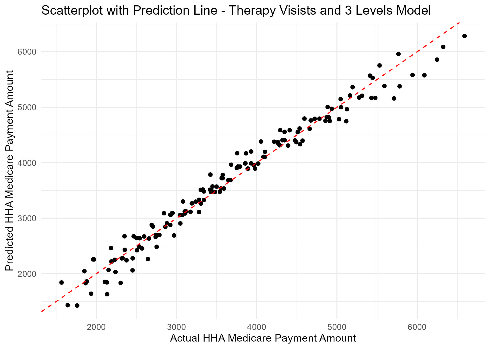

```{r setup, include=FALSE}
knitr::opts_chunk$set(echo = TRUE)
library(tidyverse)
library(htmltools)
library(knitr)
#Put Necessary Libraries Here
```

# INTRODUCTION

A Home Health Agency, or HHA, is an organization that provides health-care services to a patient's residence. While a traditional healthcare agency requires the patient to travel to it, a HHA travels to the patient. Home Health Agencies and Home Health Aides are extremely vital in the healthcare world, providing needed medical care to patients who may be more suited to stay at home. For patients who are handicapped, elderly, frail, and sensitive to traditional healthcare settings, Home Health Agencies are an absolute necessity. Unfortunately, healthcare is expensive and especially so for patients who may not be able to leave their residence for traditional healthcare. This is where Medicare is vital to these patients. With Medicare, patients who may not have been able to afford at-home healthcare now can.

In this paper, we seek to answer two questions about Home Health Agencies and how Medicare plays a part in them.

First we wanted to ask: Is there a way to predict how much Medicare will pay per visit for the cost Home Health Care? This question is valuable to know for patients who may be in-need of a Home Health Agency and are expecting to use Medicare to help pay for healthcare visits. To do this, we will have to analyze how the cost covered by Medicare changes depending on various variables. This will be important as we will determine what factors are the most important when it comes to Medicare aid.

For the second question we wanted to know if using past years data would help predict the HHA Charge of the current Year. We seek to use past year, 2014, data to fit a model and measure the accuracy for that model using predictor variables from 2015. This question is valuable to know for medicare companies that must provide coverage to patients and clients, as they could use it to receive estimates. To do this we have to fit a multitude of models to previous years data and see how well it performs in the year 2015.

# DATA

Our data was collected by The Chronic Conditions Data Warehouse and is presented by the Home Health Agency Utilization and Payment Public Use File. There is also information that describes the Medicare providers which was provided by the Centers for Medicare and Medicaid Services. All the data in our overall data set is for the years 2013 through 2015. The overall data set is comprised of small sets of data that range from information about the specific Home Health Agencies described in the data to the cost breakdown for various groupings of 153 Home Health Resource Groups (HHRGs). 

For question 1 we used the **medicare-home-health-agency-hha-hhrg-aggregate-report-cy-2015** data set. This specific data set provides information about how much Medicare provided for **153** different HHRG codes. A HHRG code, also know as a case mix score, is a standardized categorical system to group resource use for Medicare providers (Coding/PPS/OASIS terminology for home health - NAHC). These codes are made up using various variables such as **Expected Therapy Visits**, **Clinical Severity Level**, **Functional Status Level** and **Service Utilization Domain Level**. Also used in the analysis of this question was the **Average HHA Medicare Payment Amount**. This is a variable that was created by dividing the **Total HHA Medicare Payment Amount** by the **Total Episodes**, where the **Total HHA Medicare Payment Amount** is the total amount that Medicare provided for each specific HHRG and the **Total Episodes** is the total count of distinct episodes provided by all HHAs in 2015. Many of these variables were not initially given to us in the data set, so they were created by separating the data to create unique, categorical variables. 

```{r, echo = F}
includeHTML("OG Data.html")
```


This table shows the first 10 rows of the full, 153 variable data set which was used to answer Question 1. The table includes all variables mentioned above. In the table the variables **Expected Therapy Visits**, **Clinical Severity Level**, **Functional Status Level** and **Service Utilization Level** were all extracted from a single variable in the original data set called **HHRG Description**. The variable was separated to allow more precise modeling of the data. The **Expected Therapy Visits** variable is the total number of therapy visits that are expected for people grouped together. The **Clinical Severity Level** is a variable ranged from 1 to 3 which details how bad the patient's clinical condition is. The **Functional Status Level** variable, also ranged 1 to 3 described how functional the patient is. Finally, the **Service Utilization Level**, ranged 1 to 5, details how much service is expected to be needed for the patients within that group. The bar plot below is a sample of selected **HHRG** codes to show how the number of **Expected Therapy Visits** differs between them.

```{r}

```


For question 2 we used the ***medicare-home-health-agency-hha-provider-by-hhrg-aggregate-report-cy-2014*** and ***medicare-home-health-agency-hha-provider-by-hhrg-aggregate-report-cy-2015***. This data set gave information on the average HHA charge from each different combinations of HHA and HHRG. The variables used were **Average Number of Skilled Nursing Visits** in that specific combination of HHA and HHRG, **Average Number of Total Visits per Episode** performed by the HHA, the total number of **Distinct Beneficiaries**, **Average Number of Physical Therapy Visits**, **Average Number of Occupational Therapy Visits**, **Average Number of Speech Therapy Visits**, **Average Number of HHA Visits** performed by the HHA, and the **Average of Medical Social Visits**, also provided by the HHA. In addition, we also used **Expected Therapy Visits**, **Clinical Severity Level**, **Functional Status Level** and **Service Utilization Domain Level** just as we did in question 1. Below are samples of the first rows of the two data sets used.

```{r, echo = F}
includeHTML("hhap_14_des_table.html")
includeHTML("hhap_15_des_table.html")
```

# RESULTS

## QUESTION 1


To answer question 1, we wanted to show how different variables could affect our predictions for the average cost covered by Medicare per visit. To do this, we created multiple linear models with the various variables in the HHRG Aggregation data set in order to find the model that most accurately predicts the average cost covered by Medicare. To do our modeling, we used a loop to cycle through the data set and make predictions for each unique HHRG and the average cost covered by Medicare for that. Using this loop we were able to cross validate our data when predicting what the average cost would be.

Initially we used the **Clinical Severity Level**, **Functional Status Level** and **Service Utilization Level** variables to attempt to create accurate models to predict how much, on average, Medicare would cover per visit to a patient's residence. However, doing so proved that alone, these variables were not great indicators of how much would be covered on average by Medicare. Looking at the table below, even an empty Model with just the **Average HHA Medicare Payment Amount** as a variable proved to be more accurate than using the **Service Utilization Level** as a regression in a linear model. After we did predictions with all three of the different levels, we decided to use the **Expected Therapy Visits** as a categorical variable to try and predict our data. This proved to be highly successful. After doing a model using the **Expected Therapy Visits** variable, we almost cut the Root Mean Squared Error from the previous most accurate model in half. Now knowing that the **Expected Therapy Visits** was going to be the key variable to make linear models on, we decided to include the various level variables from before in a model with the **Expected Therapy Visits** to see if that would improve our results. Doing so did drastically improved our results. After all of our models were complete, we found that using the key variable of **Expected Therapy Visits** along with the three level variables (being the **Clinical Severity Level**, **Functional Status Level** and **Service Utilization Level** variables) gave us the most accurate model to predict what the average cost per visit provided by Medicare would be.


```{r, echo = F}
includeHTML("rmse_table.html")
```


In the figure below, we can see our model using the **Expected Therapy Visits** with the **Clinical Severity Level**, **Functional Status Level** and **Service Utilization Level** variables. We also plotted a red prediction line to help show us the accuracy of our data. Based on the figure, we can say that we did not majorly over predict or under predict our data when using these variables. We can say this because throughout the figure, there is an overall equal representation of points above and below our prediction line. We are happy with our this model turned out as it shows an how accurate our linear model ended up being for predicting the **Average HHA Medicare Payment Amount**. 


```{r, echo = F}

```


## QUESTION 2

In this question we try to explore how accurate using past data was to predict future data. To be more specific, we built a model to predict the HHA charge of 2015 using 2014 data set as training data. After examining visualizations of the data we decided to test multiple functions mostly using numeric variables. Our models included the use of square root functions, and polynomial functions of multiple degrees. Our method of measuring error for this question was to use the Mean Absolute Error as we could not use Root Mean Square Error because of it being so largely affected by outliers. This all lead to the conclusion that the best model to predict 2015 HHA charge was a multiple variable linear model based on the Therapy and Severity variables that we created from the variable **HHRG Description**. Despite this being the best model, there still ended up having a semi-high error score. 


```{r, echo=FALSE}
includeHTML("mae_table.html")
```


The figure below is meant to give a visualization of how the model performs in relation to the initial predictor variable and HHA charge. We see that the multiple variable linear model (red line) does a better job than the other models of capturing the data points as it goes a good way through the data and manages to capture some outlying points with better accuracy unlike the other models. This is supported by the MAE being lowest for the same multivariate linear model.

```{r, echo = F}

```


# CONCLUSION

In summary, our 2 questions were, can we predict the average cost covered by medicare given other variables and how accurately can we use previous years data from 2014 to predict HHA charge for the year 2015 given the appropriate variables. To answer these questions we created multiple models and found that for question 1, we can predict average medicare coverage fairly accurately using a multiple variable linear model based off of the **Expected Therapy Visits** and the 3 other severity level variables. While exploring question 2 we found that we can use a multiple linear model based off the same variables to predict **HHA charge**, however it was not as accurate.

In the real world, results from the model we created in question 1 may be used by medicare companies to help calculate the amount of coverage they should offer certain patients. In the real world, results from the model we created in question 2 may be used by medicare companies to help calculate the HHA charge of certain HHRG's on certain patients that medicare must cover. Furthermore, our findings show what variables may influence HHA charge and medicare coverage the most, therefore as a result this could possibly affect a client or patients choice when selecting what HHA to associate themselves with. In addition, this can be important for  people in the real world who are needing Medicare and may be concerned that more therapy visits may mean more out of pocket money for them, but actually Medicare pays more. We were able to further refine this by using the **Functional Status Level**, **Service Utilization Level** and the **Clinical Severity Level**.

In general, our conclusions for questions 1 and 2 were not as expected as we did not not think that best predictors would be in the description variable but that they would rather be among the numeric variables and some linear combination of those would give us far more accurate results. To continue our work, it would provide useful to try more models we had not thought of. Some that might yield higher results, would be a piece wise polynomial model which might prove better for HHA charge especially since we see large error happen typically as our predictor variables start to increase. In addition, it would be helpful to understand if there was any causality between severity levels and HHA charge or medicare coverage. Data that would be potentially useful would be any more specific data such as the economic level or average income of the patients or clients and this may help to predict medicare coverage even better.


# Sources

Coding/PPS/OASIS terminology for home health - NAHC. (n.d.). 
https://www.nahc.org/wp-content/uploads/2017/10/CodingTerminology.pdf


